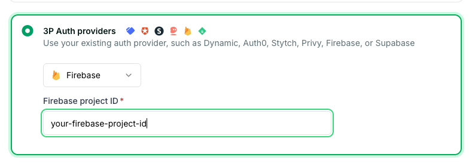

<div align="center">

<br>
<br>
<h1>Latitude Wallets Demo</h1>

<div align="center">
<a href="https://latitude-wallets-demo.vercel.app/">Live Demo</a> | <a href="https://docs.crossmint.com/introduction/platform/wallets">Docs</a> | <a href="https://www.crossmint.com/quickstarts">See all quickstarts</a>
</div>

<br>
<br>
</div>

## Introduction

Create and interact with Crossmint wallets. This demo uses Firebase Authentication with Google Sign‑In, and your email acts as the signer for your wallet.

## Authentication

Crossmint uses the Firebase JWT to create and operate the wallet for the signed‑in email.



<sub>Crossmint Console → API Keys → JWT Authentication → 3P Auth providers → Firebase. Enter your Firebase Project ID and click “Save JWT auth settings”. This is part of the setup.</sub>

**Docs:**

- Crossmint — Bring Your Own Auth (Firebase option): [docs](https://docs.crossmint.com/wallets/guides/bring-your-own-auth#bring-your-own-auth)
- Firebase — Google Sign‑In for Web: [docs](https://firebase.google.com/docs/auth/web/google-signin)

## Learn how to

- Create a wallet
- View its balance for USDXM (USDXM is a test stablecoin by Crossmint) and native tokens
- View wallet transaction activity
- Send USDXM to another wallet

## Deploy

Easily deploy the template to Vercel with the button below. You will need to set the required environment variables in the Vercel dashboard.

[](https://vercel.com/new/clone?repository-url=https%3A%2F%2Fgithub.com%2FCrossmint%2Flatitude-wallets-demo&env=NEXT_PUBLIC_CROSSMINT_API_KEY)

## Setup

 1. Clone the repository and navigate to the project folder:

    ```bash
    git clone https://github.com/crossmint/latitude-wallets-demo.git && cd latitude-wallets-demo
    ```

 2. Install all dependencies:

    ```bash
    npm install
    # or
    yarn install
    # or
    pnpm install
    # or
    bun install
    ```

 3. In the Crossmint Console, configure JWT Authentication with Firebase (as shown above): API Keys → JWT Authentication → 3P Auth providers → Firebase → enter your Firebase Project ID → Save.

 4. Set up the environment variables:

    ```bash
    cp .env.template .env
    ```

 5. Get a Crossmint client API key from Crossmint Staging [Console](https://docs.crossmint.com/introduction/platform/api-keys/client-side) and add it to the `.env` file. Make sure your API key has the following scopes: `users.create`, `users.read`, `wallets.read`, `wallets.create`, `wallets:transactions.create`, `wallets:transactions.sign`, `wallets:balance.read`, `wallets.fund`.

    ```bash
    NEXT_PUBLIC_CROSSMINT_API_KEY=your_api_key

    NEXT_PUBLIC_FIREBASE_API_KEY=your_firebase_api_key
    NEXT_PUBLIC_FIREBASE_AUTH_DOMAIN=your_firebase_auth_domain
    NEXT_PUBLIC_FIREBASE_PROJECT_ID=your_firebase_project_id
    NEXT_PUBLIC_FIREBASE_STORAGE_BUCKET=your_firebase_storage_bucket
    NEXT_PUBLIC_FIREBASE_MESSAGING_SENDER_ID=your_firebase_messaging_sender_id
    NEXT_PUBLIC_FIREBASE_APP_ID=your_firebase_app_id
    ```

 6. In Firebase Console, create a project and enable Google as a Sign‑in provider (Authentication → Sign‑in method → Google). Copy your web app config into the variables above. For detailed steps, see Firebase docs linked above.

 7. Run the development server:

    ```bash
    npm run dev
    # or
    yarn dev
    # or
    pnpm dev
    # or
    bun dev
    ```

## Launching in production

For production, the steps are almost identical, but a few changes are required:

 1. Create a developer account in the Crossmint Production [Console](https://www.crossmint.com/console/projects/apiKeys).
 2. Create a production client API key on the API Keys page with the scopes:
   `users.create`, `users.read`, `wallets.read`, `wallets.create`, `wallets:transactions.create`, `wallets:transactions.sign`, `wallets:balance.read`, `wallets.fund`.
 3. Replace your test API key with the production key and redeploy.
